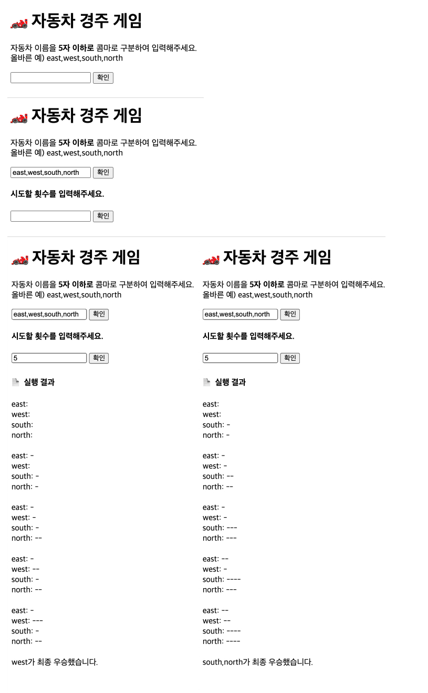

  

<h1 align="middle">자동차 경주 게임</h1>

## ✔️ 기능 설계 (ire4564)

이번 2주차 미션은 자동차 경주 게임을 아래의 요구사항에 맞춰 만드는 미션이다. 코딩컨벤션은 저번 미션과 마찬가지로 <NHN FE 개발랩>의 코딩컨벤션을 선택하여 따랐다. (ESLint 사용 예정) 또한 moudle 사용 건 때문에 별도로 https server를 설치하였다. 실행 시에는 `npm start` 를 하여 실행하면 된다.  

 

필요한 기능은 아래와 같다. 최대한 함수를 자잘하게 나누려고 노력하였으며, 함수 단위로 기능을 작성한 결과 아래와 같은 기능이 나왔다. 

 

<b>index.js</b> (root)

- [X] EventListener Setting 후 초기화 - `initEventListener`

<b>Car.js</b> (module)

- [X] 자동차 객체 생성 클래스 - `Car`
- [X] 자동차 객체 안에 이동 거리 추가 method - `move`

<b>validCarName.js</b> (module)

- [X] 자동차 이름 validation 처리 (길이, x<=5) - `validLength`
- [X] 자동차 이름 validation 처리 (중복) - `validDuplicate`
- [X] 처리에 따른 alert 알림 - `alertWrong`

<b>showDOM.js</b> (module)

- [X] 자동차 이름 입력 창 (block) & 횟수 입력창 (none) - `initDOM`
- [X] 시도할 횟수 창 보여주기 - `showNextDOM`

<b>constants.js</b> (constants)

- [X] DOM 요소 setting
- [X] 경고 문구 및 조건 setting  

<b>setResult.js</b> (module)

- [X] 한 턴 실행 결과 시각화 - `showGameResult`
- [X] 우승자 판별 - `whoIsWinner`
- [X] 우승자 출력 (여러명 case 고려) - `printWinner`

<b>playGame.js</b> (module)

- [X] 자동차 입력 수대로 Car 객체 생성 (submitCarNames)
- [X] 이동 입력 수대로 Game 처리 (submitTrunCount)
- [X] 이동 횟수만큼 게임 진행 - `startGame`
- [X] 자동자 전진 가능 판별 (x>=4) - `isMoveCar`

<b>submitCarNames.js</b> (module)

- [X] 자동차 이름 입력 처리 (Parsing) - `parseCarName` 
- [X] 자동차 입력 수대로 Car 객체 생성 - `createCars`

<b>submitCountTrun.js</b> (module)

- [X] 이동 횟수 입력 처리 - `checkInput`

* 설계하는 데 소요 시간 (1.5h)
* 개발하는 데 소요 시간 (-)

 
## ✔️ Test 결과
요구사항과 관련된 모든 테스트 사항을 통과하는 것을 확인할 수 있었다.  

 

---
## 🎯 기능 요구사항 (Basic)
초간단 자동차 경주 게임을 구현한다.

- 주어진 횟수 동안 n 대의 자동차는 전진 또는 멈출 수 있다.
- 자동차에 이름을 부여할 수 있다. 전진하는 자동차를 출력할 때 자동차 이름을 같이 출력한다.
- 자동차 이름은 쉼표(,)를 기준으로 구분하며 이름은 5자 이하만 가능하다.
- 사용자는 몇 번의 이동을 할 것인지를 입력할 수 있어야 한다.
- 전진하는 조건은 0에서 9 사이에서 무작위 값을 구한 후 무작위 값이 4 이상일 경우이다.
- 자동차 경주 게임을 완료한 후 누가 우승했는지를 알려준다. 우승자는 한 명 이상일 수 있다.
- 우승자가 여러 명일 경우 쉼표(,)를 이용하여 구분한다.
- 사용자가 잘못된 입력 값을 작성한 경우 `alert`을 이용해 메시지를 보여주고, 다시 입력할 수 있게 한다.

 

### 💻 실행 결과

 

