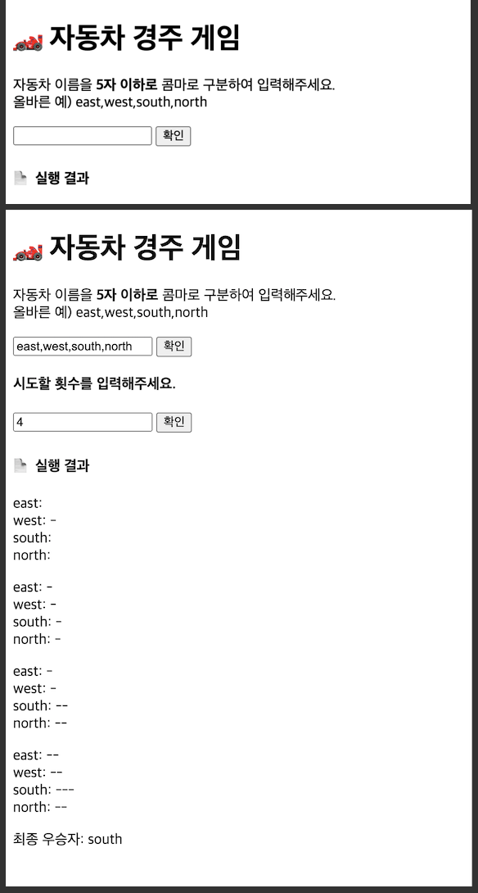

# 🏎️ 자동차 경주 게임

## 프로젝트 설명

- 자동차 이름과 경주 횟수에 대해 사용자의 입력을 받아 게임을 실행한다.
- 입력된 자동차 이름은 게임에 참여하는 자동차의 이름들이다.
- 입력된 횟수만큼 경주가 진행된다.
- 각 자동차는 부여된 숫자가 4이상일때만 움직일 수 있다.
- 가장 멀리간 자동차가 우승한다.
- 게임의 결과로 각 횟수마다 자동차들의 위치와 우승자들을 보여준다.
- https://github.com/woowacourse/javascript-racingcar-precourse

## 실행

- 지원 브라우저: Chrome v86.0, Safari v13.1.2
- live-server 모듈을 이용하여 로컬 서버로 실행 가능

```
$ npm install -g live-server  // 전역 설치
$ live-server

```

## 구조

```

.
├─ README.md
├─ LICENSE
├─ .eslintrc.json
├─ index.html
└─ src/
   │  index.js
   │  game.js
   │  car.js
   ├─ handlers/
   │      inputHandlers.js
   │      outputHandlers.js
   └─ common/
           message.js
           util.js
           validate.js


```

- car.js : `Car` 클래스 - 게임에 참여할 car객체
- game.js : `Game` 클래스 - 게임 로직, `Car`인스턴스를 생성하고 경주를 진행하고 우승자 뽑는 메서드

- inputHandler.js : `InputHandler` 클래스 - 사용자의 입력을 받고 분석, 검증하는 메서드
- outputHandler.js : `OutputHandler`클래스 - 게임 결과를 구성하여 사용자에게 보이는 메서드

- message.js : alert 메세지를 관리하는 객체모듈
- util.js : 보조적인 연산을 하는 기능들. 재사용 가능성
- validate.js : 입력값을 검증하는 기능들. 검증 조건이 바뀔 때 수정이 용이할 수 있도록 한 곳에 관리함

## 실행 이미지



---

## 구현 기능 목록

1. 입력 받기

- 이름 입력 버튼 실행

  - [x] input 태그 값을 읽는다.
  - [x] 입력 문자열의 공백은 자동으로 제거한다.
  - [x] 입력 문자열을 쉼표 기준으로 분리하여 배열로 변환한다.

  - [x] 입력된 이름값을 모두 검사한다

    - 한글자 미만 5자 초과인 경우 / 중복인 인경우 `alert`

  - [x] 검사 통과시 횟수 입력 칸을 display한다: DOM

- 시도 횟수 입력 버튼 실행

  - [x] input 태그 값을 읽는다.
  - [x] 입력 문자열을 Number타입으로 변환한다.

    - cf. `<input type = number>`는 숫자 외에 .,+,-,e 만 입력가능 -> 숫자변환시 0
    - string은 숫자변환시 NaN

  - [x] 입력된 횟수 값을 검사한다.

    - 자연수가 아닐 경우 (= 정수가 아니고 1보다 작은 경우 / NaN일 경우) `alert`

- [x] 검사 통과시 게임을 실행한다
- [x] 게임 결과를 출력한다.

3. 게임

- [x] 입력된 이름으로 Car객체를 생성한다.
- [x] 입력된 시도 횟수만큼 경주한다.

  - [x] 0~9 랜덤값을 생성한다.
  - [x] 각 횟수마다 자동차에 랜덤값을 부여한다.
  - [x] 각 횟수마다 각 car의 위치를 배열에 담는다.
    - 각 횟수마다 car들의 위치를 출력해야 한다.

- [x] 자동차는 자신의 랜덤값에 따라 움직인다: 4이상일 경우만

- 횟수가 끝나면 가장 많이 전진한 자동차를 구한다.
  - [x] 가장 멀리간 위치를 구한다.
  - [x] 해당 자동차의 이름을 구한다.

4. 출력 : DOM

- [x] 시도 횟수마다 각 자동차의 위치를 출력한다.
- [x] 우승자들을 출력한다.
  - 우승자는 쉼표로 구분한다.
- [x] 출력물을 모두 구성한 후에 렌더링한다.

5. 게임 조작

- [x] 입력 모듈을 통해 사용자에게 입력을 받고 처리하고 검증한다.
- [x] 입력값을 받아 게임을 실행한다.
- [x] 게임 결과를 출력 모듈을 통해 출력물을 구성하여 사용자에게 보여준다.
- [x] 버튼에 맞게 실행 이벤트를 위임한다.
