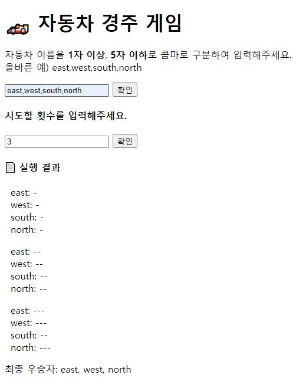

# 🏎️ 자동차 경주 게임

[우아한 테크 코스 - 3기] 프리코스 2주차 미션을 진행한 저장소입니다.
[미션내용 확인하기](./MISSION.md)

## 🎯 구현 기능

- 자동차 이름을 입력받는 창을 화면에 출력한다.
- 자동차 이름 입력받는다.
  - 입력 조건: 각 자동차 이름은 5자 이하이며, 콤마로 구분하여 입력한다.
- 자동차의 이름이 정상적으로 입력되지 않은 경우, `alert`창을 띄운 후 입력된 값을 지운다.
- 자동차의 이름이 정상적으로 입력된 경우, 시도할 횟수를 입력하는 창을 화면에 출력한다.
- 시도할 횟수 입력받는다.
  - 입력된 횟수는 자연수여야 한다.
- 시도할 횟수가 정상적으로 입력되지 않은 경우, `alert`창을 띄운 후 입력된 값을 지운다.
- 시도할 횟수가 정상적으로 입력된 경우 실행결과 컴포넌트를 생성한다.
- 매 회차마다 각 자동차별로 0~9 사이의 랜덤한 값을 구하고 4 이상일 경우 전진하고 3 이하일 경우 멈춘다.
- 매 회차마다 각 자동차가 얼만큼 전진했는지 화면에 출력한다.
- 최종 우승자를 찾아 화면에 출력한다.

## :exclamation: 예외 처리

### CarNamesInput

- 입력된 값이 없음 -> `alert`
- 입력된 이름 중 `''`(빈 문자)이 있음 -> `alert`
- 같은 이름이 2개 이상 -> 제한하지 않고 순서로 구분
- 입력된 이름의 개수가 2개 미만 -> 제한하지 않음
- 조건을 충족하는 이름 입력 후 수정
  - 새로 입력한 값이 조건을 충족하지 않음 -> 횟수 또는 실행 결과가 나타나 있었다면 사라지고 `alert`
  - 새로 입력한 값이 조건을 충족함 -> 실행 결과가 나타나 있었다면 새로 입력한 값으로 새로운 게임 결과 출력

### RacingCountInput

- 입력된 값이 없음 -> `alert`
- 입력된 값이 숫자가 아닐 때 -> `<input type="number">`이므로 입력된 값이 없는 경우와 같음 `alert`
- 입력된 값이 0이하 -> `alert`
- 입력된 값에 소수점이 있는 경우 -> `alert`
- 실행 결과 출력 후 수정 -> 새로 입력한 값으로 새로운 게임 결과 출력

## :computer: 실행 결과

