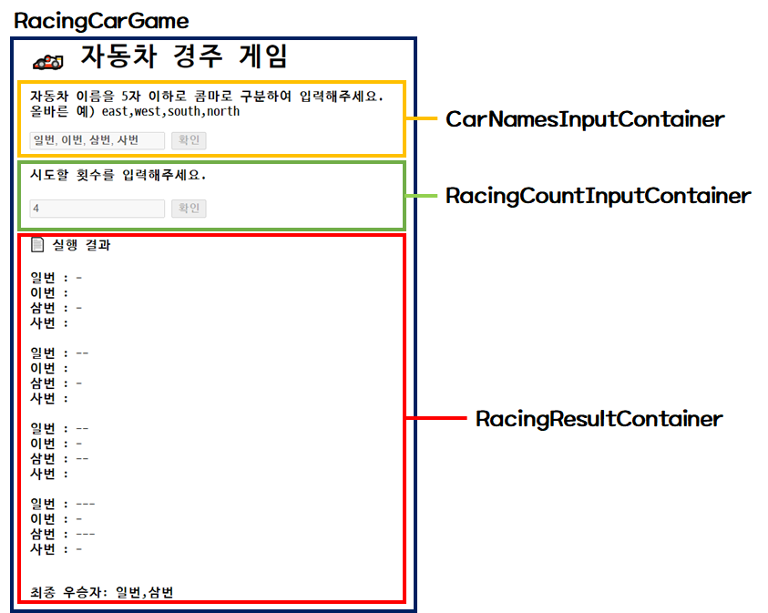

# 🏎️ 자동차 경주 게임
> 사용자로부터 자동차 이름과 수행횟수를 입력받아 가장 많이 이동한 자동차를 출력하는 어플리케이션입니다.

## 🎯 전체적인 구조

```sh
├── index.js
├── Components
│   ├── RacingCarGame.js              # 하위 컴포넌트를 총괄하는 최상위 컴포넌트
│   ├── CarNamesInputContainer.js     # 자동차 이름을 입력받는 컴포넌트
│   ├── RacingCountInputContainer.js  # 경주 횟수를 입력받는 컴포넌트
│   └── RacingResultContainer.js      # 매 라운드 결과 및 최종 우승자를 출력하는 컴포넌트
├── classes
│   └── Car.js
└── utils
    ├── gameUtil.js    # 랜덤 숫자 생성, 차량 이동 결정과 같은 게임 진행과 관련한 유틸
    ├── inputUtil.js   # 사용자가 입력한 값에 대한 전처리를 담당하는 유틸
    ├── domUtil.js     # DOM API를 활용한 유틸
    ├── templates.js   # HTML 템플릿을 만들기 위한 유틸
    ├── validations.js # 사용자 입력값에 대한 검증을 위한 유틸
    └── constants.js   # 각종 상수값을 모아놓은 유틸
```



## 🎯 동작 시나리오

### 1. 자동차 이름 입력

1. 자동차 이름을 쉼표(,)를 기준으로 입력하기
   - 이름은 5자 이하
   - 이름 중복 허용 X
   - 빈 입력 X
2. 참가자 입력 완료 => 이동 횟수 입력 폼 활성화

### 2. 이동 횟수 입력

1. 몇 번 이동할 것인지 입력하기
   - 0보다 큰 숫자
2. 이동 횟수 입력 완료 => n번의 이동 경로 출력

### 3. 자동차 이동 및 출력

1. 각 자동차 -> 0~9 사이 랜덤 값 얻기
2. 값에 따라 자동차 이동
   - n >= 4 : 이동
   - n < 4 : 멈춤
3. 각 라운드마다 각 자동차의 이동 경로 출력

### 4. 승자 출력

1. 모든 이동이 끝나면 가장 많이 이동한 자동차 => 우승자
   - 승자는 여러명도 가능
2. 이동 경로 하단에 우승자 출력
   - `출력 형식` : **최종 우승자 : [우승자 명]**
   - 우승자가 다수라면 쉼표(,)로 구분하기

## 🎯 기능 목록

### RacingCarGame 컴포넌트

1. APP에 필요한 컴포넌트 및 상태값 초기화 기능
2. 상태값 조회 및 업데이트 기능
3. 레이싱 게임 로직 수행 기능
4. 우승자 배열 생성 기능

### 자동차 이름 입력 관련

1. 입력받은 문자열을 쉼표를 기준으로 배열로 변환하는 기능
2. 입력받은 문자열을 검증하는 기능
   - 빈 값, 중복된 값, 각 이름이 5자 이하

### 라운드 횟수 입력 관련

1. 입력받은 문자열을 숫자로 변환하는 기능
2. 입력받은 문자열을 검증하는 기능
   - 0이하의 값, 빈 값

### 진행상황 및 우승자 출력 관련

1. 상태값을 기준으로 HTML 문자열로 변환하는 기능
2. 우승자 배열을 토대로 HTML 문자열로 변환하는 기능
3. 진행 상황 및 최종 우승자를 화면에 렌더링 하는 기능

### 기타 기능

1. Car 인스턴스 이동시키는 기능
2. 특정 DOM요소를 활성화/비활성화 시키는 기능
3. 랜덤 숫자 생성 및 이동 여부 파악 기능
4. 잘못된 입력값에 대해 적절한 메시지를 보여주는 기능

## 🎯 기타

[2주차 미션 진행](https://www.notion.so/2WEEK-e2967be6711542b185a58858e0ec2584)
