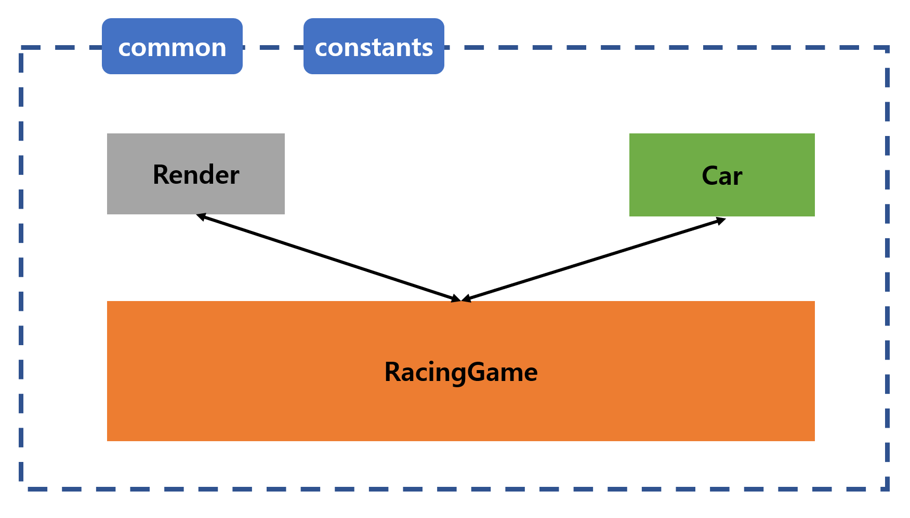

# 자동차 경주 게임
> 바닐라 자바스크립트로 구현하는 자동차 경주 게임!

<br>

## 1️⃣ 사용한 라이브러리와 버전
### 🗃 랜덤 라이브러리
- `@woowacourse/mission-utils`: 1.0.1
  - CDN으로 설치

<br>

### 🗃 Linter 관련
- `eslint`: 8.3.0
- `eslint-config-airbnb`: 19.0.1
- `eslint-config-prettier`: 8.3.0
- `eslint-plugin-cypress`: 2.12.1
- `eslint-plugin-import`: 2.25.3
- `eslint-plugin-jsx-a11y`: 6.5.1
- `eslint-plugin-prettier`: 4.0.0
- `prettier`: 2.4.1

<br>

## 2️⃣ 기능 구현 단계 정의
> 주어진 [**기능 요구사항**](https://github.com/InSeong-So/javascript-racingcar-precourse#-%EA%B8%B0%EB%8A%A5-%EC%9A%94%EA%B5%AC%EC%82%AC%ED%95%AD)을 따라 작성합니다.

<br>

우선 기능 요구사항을 분리했습니다.
1. 자동차 이름 입력 이벤트
2. 자동차 이름 제출 이벤트
3. 레이싱 횟수 입력 이벤트
4. 레이싱 횟수 제출 이벤트
5. 게임 진행
6. 게임 종료 및 결과 렌더링

<br>

입력 받은 자동차의 이름만큼 레이싱 횟수에 따른 난수 생성으로 게임을 진행해야 하므로 이를 어떻게 분리할지 고민했습니다.

자동차 별로 기능이 다른 것이 아니므로 클래스로 만들어 자동차 갯수만큼 인스턴스를 생성하기로 했습니다.

또한 자동차는 레이싱 횟수에 종속된 상태입니다. 레이싱의 최대 횟수만큼 자동차가 전진할 가능성이 존재하므로 레이어를 분리하여 상위 클래스 하나로 자동차 경주 게임을 제어하기로 했습니다.

따라서 자동차는 가장 최하위의 클래스로 배치하고, 게임이라는 클래스로 레이싱에 관련된 공통된 데이터(레이싱 횟수, 난수 생성/판별, 결과 렌더링)를 제어하기로 했습니다.

DOM이 가지는 이벤트는 클래스에 종속시키지 않고 별도의 handler로 분리하여 유효성 검사를 실행하기로 했습니다.

<br>

<div align=center>



</div>

<br>

### 🛠 환경 설정
> 일관성 있는 코드를 위해 ESLint, Prettier를 설정하고 Airbnb 스타일을 적용한 뒤 추가적인 규칙을 정의합니다.

**사전 정의**
- [x] 1. 의존성 라이브러리를 설치하고 Linter를 설정합니다.

**추가 사항**
- [x] `index.html`에 input/button의 id값을 넣는다.

<br>

> 커밋 목록
- [**첫 번째 커밋 바로가기**](https://github.com/InSeong-So/javascript-racingcar-precourse/commit/7bf813791452617abebc9131f970d7388b714287)

<hr>
<br>

### 🛠 자동차 이름 입력 이벤트
> 자동차의 이름을 입력하는 태그는 **input**이며 선택자는 `id="car-names-input"` 입니다.

**사전 정의**
- [ ] ~~1. 쉼표를 기준으로 자동차 이름을 구분합니다.~~
- [ ] ~~2. 각 자동차의 이름은 최대 5자 이하입니다.~~
- [ ] ~~3. 입력 값이 잘못되었다면 alert을 출력하고 focus합니다.~~

**추가 사항**
- *1,2,3번 기능을 자동차 이름 제출 이벤트 시 확인으로 변경합니다.*

<hr>
<br>

### 🛠 자동차 이름 제출 이벤트
> 자동차의 이름을 제출하는 태그는 **button**이며 선택자는 `id="car-names-submit"` 입니다.

**사전 정의**
- [x] 1. 자동차를 class 컴포넌트로 구현하고, 전진 기능을 추가합니다.
- [x] 2. 전진 횟수를 멤버 변수로 가집니다.
- [x] 3. 입력된 자동차의 이름을 분리하여 인스턴스화 합니다.
- [x] 4. 초기화를 담당합니다. 제출 이벤트가 일어날 때마다 인스턴스가 새로이 생성됩니다.
- [x] 5. `이름: 전진 횟수`를 화면에 출력될 수 있는 DOM 객체를 생성합니다.

**추가 사항**
- [x] 쉼표를 기준으로 자동차 이름을 구분합니다.
- [x] 각 자동차의 이름은 최대 5자 이하입니다.
- [x] 입력 값이 잘못되었다면 alert을 출력하고 focus합니다.
  - [x] 이름의 양 끝에 공백이 들어갈 순 없습니다. 즉 문자 중앙에는 들어가도 됩니다.
  - [x] 이름이 없을 수는 없습니다.
  - [x] 중복된 이름이 있으면 안됩니다.
  - [x] ~~alert은 최초 입력 값과 비교한 뒤 포괄적으로 출력(`옳지 못한 입력값입니다. ...`)하며, 추후 리팩토링이 가능하다면 진행합니다.~~ 각 입력에 대한 케이스를 분리하여 에러 메세지를 출력합니다.

<br>

> 커밋 목록
- [**✒️Feat: 자동차 이름 제출 이벤트 바로가기**](https://github.com/InSeong-So/javascript-racingcar-precourse/commit/67eb03f05f4f408d5349acc2dea534f9e91e6e8a)
- [**✒️Feat: 자동차 이름 제출 이벤트 2 바로가기**](https://github.com/InSeong-So/javascript-racingcar-precourse/commit/f1e6c89d119db5d7eccc1685c881137d3a443b7a)

<hr>
<br>

### 🛠 레이싱 횟수 입력 이벤트
> 레이싱 횟수를 입력하는 태그는 **input** `id="racing-count-input"` 입니다.

**사전 정의**
- [ ] ~~1. 숫자만 입력됩니다. keydown 이벤트로 keycode가 0(48)부터 9(57) 사이인지 검증합니다.~~
- [x] 2. `자동차 이름 제출 이벤트`가 발생하면 해당 input을 초기화합니다.
- [x] 3. 음수가 입력되는 경우 alert을 출력하고 값을 비운 뒤 focus 합니다.
- [x] 4. 소수점이 입력되는 경우 alert을 출력하고 값을 비운 뒤 focus 합니다.
- [x] 5. 0만 입력되는 경우 alert을 출력하고 값을 비운 뒤 focus 합니다.
- [x] 6. 0이 선입력되어 01, 0123 등의 값이 표시되면 change 이벤트로 0을 제거합니다.

**추가 사항**
- *1번의 경우 주어진 index.html에 정의된 input의 타입이 number 형이므로 구현하지 않습니다.*

<br>

> 커밋 목록
- [**✒️Feat: 레이싱 횟수 입력 이벤트 바로가기**](https://github.com/InSeong-So/javascript-racingcar-precourse/commit/909a1bfd7215306776db356feace35b8972cbb9a)

<hr>
<br>

### 🛠 레이싱 횟수 제출 이벤트
> 레이싱 횟수을 제출하는 태그는 **button** `id="racing-count-submit"` 입니다.

**사전 정의**
- [x] 1. 숫자만 입력되었는지 재검증합니다.
- [x] 2. `0123`의 경우 `123`으로 간주합니다.
- [x] 3. 제출이 성공적으로 완료되면 게임 진행 단계로 넘어갑니다.

**추가 사항**
- *class 컴포넌트로 Game을 구현하여 호출합니다.*
- [x] h4 태그에 css 선택자인 id값을 `#racing-result`로 부여합니다.

<br>

> 커밋 목록
- [**✒️Feat: 레이싱 횟수 입력 이벤트 바로가기**](https://github.com/InSeong-So/javascript-racingcar-precourse/commit/909a1bfd7215306776db356feace35b8972cbb9a)
- [**📝Docs: 기능 목록 수정 바로가기**](https://github.com/InSeong-So/javascript-racingcar-precourse/commit/eeb81b3e8f01312c3fc3d0fd9c26907bd482dd8c)

<hr>
<br>

### 🛠 게임 진행
> 전진 조건은 MissionUtils.Random.pickNumberInRange의 난수가 4 이상인 경우입니다.

**사전 정의**
- [ ] ~~1. 게임을 class 컴포넌트로 구현하며 게임에 필요한 유효성 검사를 추가합니다.~~
- [x] 2. 구조 분해 할당을 활용하여 클래스와 상관 없는 전역 스코프에 선언한 함수로 지정된 횟수만큼 난수를 출력합니다.
- [x] 3. 출력된 난수가 전진 조건에 해당되면 해당 자동차의 전진 횟수를 증가시키며, 모든 자동차의 전진 여부를 확인합니다.
- [ ] ~~4. 모든 자동차의 전진 여부를 확인하고 레이스마다 결과를 렌더링합니다.~~
  - [ ] ~~특정 엘리먼트를 index.html에 추가할 수 없으므로, 최상위 div인 `id="app"`에 element를 생성하여 appendChild합니다.~~
- [ ] ~~5. 횟수가 전부 소진되면 최상위 div인 `id="app"`에 결과를 출력할 영역인 h4 `id="racing-result"`에 appendChild합니다.~~
- [ ] ~~6. 결과는 span `id="racing-winners"` 태그에 표시하고 span 태그를 h4 영역에 appendChild 합니다.~~

**추가 사항**
- *1번의 경우 레이싱 횟수 제출 이벤트에서 구현합니다.*
- *4번의 옵션은 h4 `id="racing-result"` 하위에 div를 생성하고 각 car의 레이스 정보를 추가하는 방식으로 구현합니다.*
- *5, 6번은 추후 렌더링을 담당하는 클래스를 생성하여 해당 책임을 분리하도록 구현합니다.*

- [x] 기능별로 메서드를 분리합니다.
  - [x] 게임 시작/초기화
  - [x] 게임 진행
  - [x] 게임 종료
- [x] 결과는 1회만 렌더링해도, 레이스별로 렌더링해도 문제 없게 렌더링을 담당하는 class를 구현합니다.
  - [x] 게임이 종료되면 최종 우승자의 텍스트 값을 렌더링 클래스에 파라미터로 넘겨 결과를 렌더링하도록 합니다.

<br>

> 커밋 목록
- [**✒️Feat: 게임 진행 바로가기**](https://github.com/InSeong-So/javascript-racingcar-precourse/commit/44cbca2b9865cee66a3d17249dd8af7411bab6b7)

<hr>
<br>

### 🛠 게임 종료
> 최종 우승자를 출력하는 태그는 **span** `id="racing-winners"` 입니다.

**사전 정의**
- [ ] ~~1. **div** 태그, 선택자 `id="racing-result"`에 span 영역을 그립니다.~~
- [x] 2. 전진 횟수가 가장 높은 자동차가 우승이며, 해당 자동차의 텍스트를 span 영역에 표시합니다.
  - [x] 우승은 여럿일 수 있습니다.
  - [x] 전부 전진 횟수가 동일하거나 존재하지 않는다면 모두가 우승자입니다.

**추가 사항**
- *1번의 경우 중복되는 기능이므로 삭제합니다.*

- [x] 렌더링 클래스를 구현하여 아래 책임을 위임합니다.
  - [x] 게임이 재시작되면 결과창을 초기화시키는 메서드를 구현합니다.
  - [x] 렌더링 클래스는 레이스마다 결과를 저장하는 div와 결과를 출력할 때 사용할 h4의 자식 중 최상위인 div를 멤버 변수로 갖습니다.
  - [x] 횟수가 전부 소진되면 h4 자식 중 최상위 div에 레이스별 결과가 저장된 멤버 변수를 appendChild합니다.
  - [x] 결과는 span `id="racing-winners"` 태그에 RacingGame 클래스에서 전달받은 winners 텍스트를 표시하고 span 태그를 h4 영역에 appendChild 합니다.
  - [x] 결과를 렌더링하기 전 winners 텍스트를 span 태그로 변환하는 기능을 구현합니다.
- [x] 렌더링 클래스는 결과를 DOM에 반영해야 하므로 타겟 Element 객체가 필요합니다. RacingGame에서 전달합니다.

<br>

> 커밋 목록
- [**✒️Feat: Render Class 커밋 바로가기**](https://github.com/InSeong-So/javascript-racingcar-precourse/commit/9af0001421566cb2a27dd37f6bac500d4c10376b)
- [**✒️Feat: 게임 진행 2 바로가기**](https://github.com/InSeong-So/javascript-racingcar-precourse/commit/e9e97f76e61d9b4f6def862dc22d2a51ef6168ce)

<hr>
<br>

## 3️⃣ 디렉토리 구조
```
│  .eslintrc.js
│  .gitignore
│  .npmrc
│  cypress.json
│  index.html
│  LICENSE
│  package-lock.json
│  package.json
│  README.md
│
├─docs
│  │  README.md
│  │
│  └─images
│          flow.jpg
│
├─images
│      racingcar_icon.png
│      result.gif
│      result.jpg
│      test_result.png
│
├─src
│  │  index.js
│  │
│  ├─common
│  │      utils.js
│  │      validations.js
│  │
│  ├─components
│  │      Car.js
│  │      index.js
│  │      RacingGame.js
│  │      Render.js
│  │
│  └─constants
│          index.js
│
└─test
        app.spec.js
```

<br>