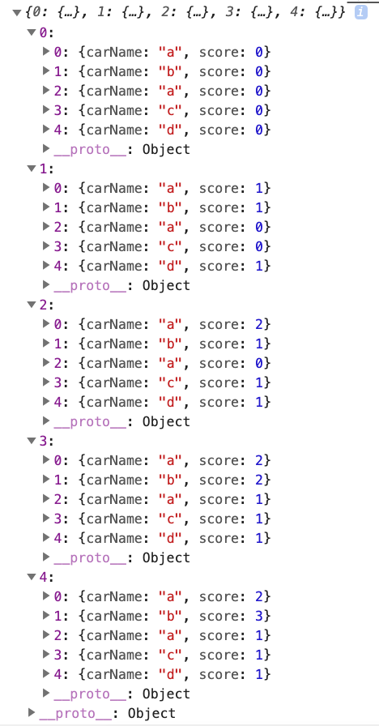

# 🏎️ 자동차 경주 게임

## 🏊‍♀️ 우아한테크코스의 프리코스 2주차 프론트엔드 미션

- 주어진 횟수 동안 n대의 자동차가 경기를 하여 가장 많이 움직인 우승자를 뽑습니다.
- [우아한테크코스 미션 저장소](https://github.com/woowacourse/javascript-racingcar-precourse)

## 🎁 목차

1. [기능 요구사항](#기능-요구사항)
2. [구현할 기능 목록](#구현할-기능-목록)
3. [프로젝트 구조](#프로젝트-구조)
4. [구현 설명](#구현-설명)
5. [프로그램 실행 결과](#프로그램-실행-결과)
6. [2주차 미션을 하면서](#2주차-미션을-하면서)

## 🎯 기능 요구사항

- 주어진 횟수 동안 n대의 자동차는 전진 또는 멈출 수 있다.
- 자동차에 이름을 부여할 수 있다. 전진하는 자동차를 출력할 때 자동차 이름을 같이 출력한다.
- 자동차 이름은 쉼표(,)를 기준으로 구분하며 이름은 5자 이하만 가능하다.
- 사용자는 몇 번의 이동을 할 것인지를 입력할 수 있어야 한다.
- 전진하는 조건은 0에서 9 사이에서 random 값을 구한 후 random 값이 4 이상일 경우 전진하고, 3 이하의 값이면 멈춘다.
- 자동차 경주 게임을 완료한 후 누가 우승했는지를 알려준다. 우승자는 한 명 이상일 수 있다.
- 우승자가 여러명일 경우 ,를 이용하여 구분한다.

## 🕹 구현할 기능 목록

**class GetCarNames / getCarNamesBtnClick.js**

- [x] car names 입력값 받기
  - [x] 올바른 입력값 판단 `isCorrectCarNames(vaildValue.js)`
    - 5자 이하의 숫자,영어,한글로 구성된 이름
    - 공백포함 안됨, 특수문자 안됨
    - 중복된 이름 가능
    - 입력된 값은 쉼표(,)로 이름을 구분 한다
  - [x] 잘못된 입력값 메시지(alert) 출력
  - [x] racing count 화면에 요소 보여주기

**class GetRacingCount / getRacingCountBtnClick.js**

- [x] racing count 입력값 받기
  - [x] 올바른 입력값 판단 `isCorrectRacingCount(vaildValud.js)`
    - 숫자만 입력 가능
    - 맨처음 입력값이 0은 안됨, 공백안됨
  - [x] 잘못된 입력값 메시지(alert) 출력

**duplicateInputBan(targetInput, targetBtn) / initialComponent.js**

- [x] 중복 입력 방지

**this.racingGameRecord / racingGame.js**

- [x] racing count 횟수마다 게임 결과를 담을 racingGameRecord 객체

**getRandomNumber.js**

- [x] 0에서 9사이 random 값 구하기

**racingGame.js**

- [x] racing count 횟수마다 게임 결과를 저장 및 업데이트
  - [x] 각 횟수(라운드)마다 게임 결과 저장 및 업데이트
  - [x] 각 횟수(라운드)마다 최고 값을 가진 자동차들 저장 및 업데이트
  - [x] 게임 기록 반환

**render.js**

- [x] render 게임 결과 화면에 출력 `setRender()`
  - [x] 게임 진행 과정 `gameRecordDisplay()`
  - [x] 게임 우승자 구하기`setWinnerResult()`
    - [x] 게임 우승자가 다수일 경우 ,로 구분 하여 출력

**gameReset() / app.js**

- [x] 게임 재시작 구현

## 🔨 프로젝트 구조

```sh
javascript-racingcar-precourse
|
|-- docs
    |-- README.md
|-- images
    |-- result.gif
    |-- result.jpg
    |-- gameRecord.jpg
|-- src
    |-- constants
        |-- varivables.js
    |-- js
        |-- components
            |-- initialComponent.js
        |-- events
            |-- getCarNamesBtnClick.js
            |-- getRacingCountBtnClick.js
        |-- eventsHandler.js
        |-- racingGame.js
        |-- render.js
    |-- styles
        |-- index.css
    |-- utils
        |-- getRandomNumber.js
        |-- vaildValue.js
    |-- app.js
|-- index.html
|-- indes.js
|-- LICENSE
```

## 🛠 구현 설명

**eventHandler**

- 초기 `클래스 Component / initialComponent.js` 에서 `클래스 GetCarNames / getCarNamesBtnClick.js`, `클래스 GetRacingCount / getRacingCountBtnClick.js`, `클래스 EventHandler / eventHandler.js`, `클래스 App / app.js` 순으로 **상속**을 받아 이벤트처리에 대한 모듈을 만듭니다.
- 각 입력값이 올바르다면 재 입력을 방지하기 위해 해당 input태그의 속성에 `disabled`를 주었고 button태그에는 `display: none`속성을 가지는 css 클래스 선택자 `js-hidden__btn`를 클래스 속성값으로 넣어주었습니다.

**racingGame**

- 입력된 자동차의 이름은 this.carNames = ['east', 'west', 'south', 'north']의 배열로 초기화 되어 있습니다.
- 입력된 횟수를 라운드라고 칭하겠습니다. 매 라운드마다 게임의 결과는 저장되어서 전체 게임 기록을 가지고 rendering 해야 겠다는 생각에 `게임 기록을 담는 racingGameRecord 객체`를 생성했습니다.
- `racingGameRecord 객체`의 key 값은 라운드 숫자를 주었고 value 값은 그 라운드의 게임 결과를 객체로 담았습니다.
- 각 라운드의 게임 결과를 담은 객체의 key 값은 `순서대로 입력된` 자동차의 `인덱스` 값이며 value 값은 객체이며 그 객체는 해당 인덱스의 `carName: 자동차이름`, `score: 점수(이전 라운드 점수와 현재 라운드의 점수의 합)`를 담았습니다.
- 순서대로 입력된 자동차의 `인덱스`기준으로 key값을 준 이유는 자동차의 이름이 중복되거나 영어, 한글, 숫자로도 구성되어 있다고 생각했기 때문에 자동차의 점수가 자신에게 반영되기 위해서는 이름이 아니라 `인덱스`를 기준으로 해야 한다고 생각했습니다. (예시 ['east', 'west', 'south', 'east', '동해' '1동해'])
- 자동차가 `전진`하게 된다면 score 점수는 `이전 라운드 점수에서 +1 을 한 값`이고, `멈춘`다면 `이전 라운드 값`과 같습니다.
- racingGameRecord 객체 예시입니다.



**render**

- `racingGameRecord 객체`에서 각 라운드의 게임기록과 최종우승자 텍스트를 Template literals형식으로 만들어서 해당 HTML 요소의 innerHTML 값으로 넣어 줍니다.

## 💻 프로그램 실행 결과


## 🧑‍💻 2주차 미션을 하면서

1주차 때 처음으로 class 형식으로 메서드를 분리하여 구현을 했다면, 2주차 때는 상속을 하면서 클래스 별로 역할과 프로그램 흐름에 따른 메서드를 구현하면서 많은 생각을 하게 되었습니다. 파일구조를 짜는 것부터 어디서 부터 상속을 받아야 하는지 아니면 상속을 안 받고 클래스를 따로 만들어야 하는지 이벤트 처리는 어디서부터 해야 하는 것인지...등 생각을 통해 2주차에서는 노트를 펴놓고 생각을 정리하는 시간이 많았습니다. 그리고 자바스크립트 컨벤션에 맞춰 좀 더 네이밍에 신경을 썼으며 자주 사용하는 함수는 분리하고 상수화 시킨 변수는 따로 분리했습니다.

좀 더 생각해보거나 시도해 봐야 할 것이 있다면 이벤트 처리 부분과 게임을 재시작하기 위한 수단으로 브라우저를 새로고침 한 부분입니다.
초기에 컴포먼트 클래스에서 계속 이벤트 클래스들을 상속 하여 게임의 모듈을 만드는 것이 좋은지 따로 이벤트 처리 부분을 모듈화 시켜 App 클래스의 생성자 메서드에 초기화 하는게 좋은 지 아직은 잘 모르겠습니다. 그리고 게임을 재시작 한다는 것은 브라우저를 새로고침하는 것 보다는 새로운 게임 객체를 생성하는게 맞다고 생각이 듭니다. 이부분에서도 좀 더 나은 방법을 알아 봐야 겠습니다.

3주차 미션을 기달리며 남은 시간동안 부족한 부분은 체우고 반복 학습을 통해 더 나은 코드를 짤수 있도록 노력하겠습니다.
감사합니다.
