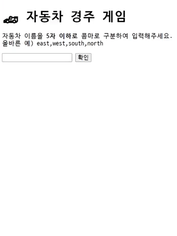

# 자동차 경주 게임

## 프로젝트 개요✨

친구, 가족들과 같이 즐길 수 있는 자동차 경주 게임을 개발한 프로젝트입니다😉

 

 

## 데모 사이트💻

아래 링크로 가서 미리 자동차 경주 게임을 즐겨보세요! [경주게임 하러 가보기😀](https://racinggame-sangminsong.netlify.app/)

(*아쉽게, 이번 프로젝트에서는 기존 html에 태그를 추가하는 게 불가능해서 첫 화면 로딩시 숨겨져야할 요소들이 보였다가 숨겨지는 점 양해부탁드립니다.)

 

## 기능 목록📌

### 자동차 자체 기능

---

- [x] 전진하는 기능을 가진다.

  - [x] 전진하는 조건에 필요한 0에서 9사이의 무작위 값을 구한다.
  - [x] 무작위 값이 4이상일 경우에만 전진하도록 한다.
- [x] 이름을 가질 수 있다.
  - [x] 5자 이하여야 한다.
- [x] 위치를 가질 수 있다.

 

### 입력 기능

---

- [x] 사용자는 n대의 자동차 이름을 쉼표(,)를 기준으로 입력 한다.

  - [x] 최소 2대의 자동차 이름이 있는 지 판별한다.
  - [x] (예외사항) 자동차의 개수가 1대 이하가 제출되었을 경우
  - [x] 사용자가 잘못된 입력 값을 작성한 경우 alert를 이용해 메세지를 보여준다.
  - [x] 이후, 다시 입력할 수 있게 input창을 리셋시켜준다.

- [x] 자동차 이름을 입력받아야만 이동 횟수를 입력할 수 있는 창이 보여진다.

- [x] 사용자는 몇 번의 이동을 할 것인지 입력한다.

  - [x] 입력값이 1보다 큰지 판별한다.
  - [x] (예외사항) 입력값이 음수나 0일 경우
  - [x] 사용자가 잘못된 입력 값을 작성한 경우 alert를 이용해 메세지를 보여준다.
  - [x] 이후, 다시 입력할 수 있게 input창을 리셋시켜준다.

 

### 출력 기능

---

- [x] 자동차 이름과 이동 횟수를 모두 입력받아야만 결과 타이틀이 보여진다.

- [x] 주어진 횟수 동안 n대의 자동차가 전진 또는 멈추는 것을 출력한다.

  - [x] 전진하는 자동차를 출력할 때는 자동차 이름을 같이 출력한다.

- [x] 자동차 게임을 완료한 후 누가 우승했는 지를 알려준다.

  - [x] 우승자는 한 명 이상일 수 있다.
  - [x] 우승자가 여러 명일 경우 쉼표(,)를 이용하여 구분한다.

 

### 기타사항

---

- [x] (예외사항) 자동차 이름들과 이동 횟수 모두 정상적으로 등록이 되야만 게임을 진행할 수 있다.
