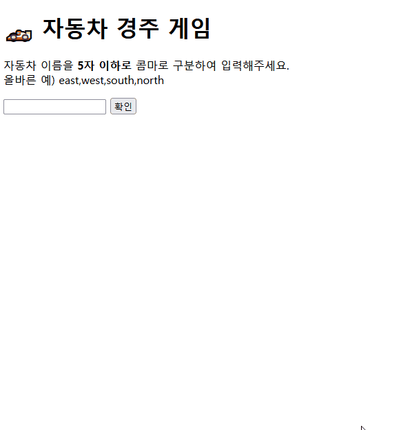
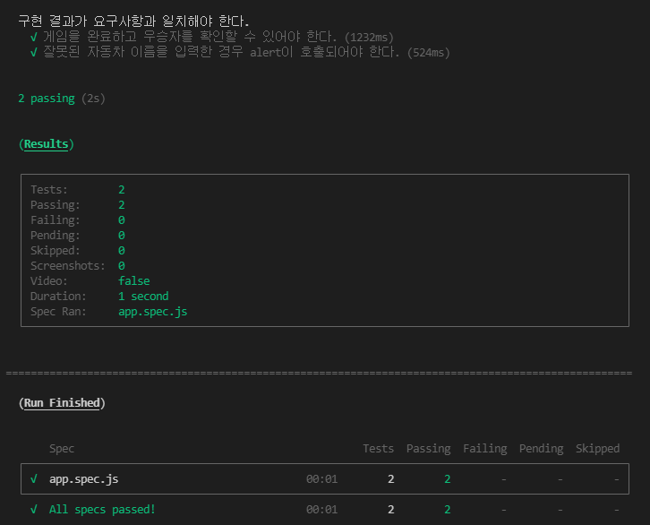

# 프리코스 2주차 - 자동차 경주 게임 ⚾

## 🕹️ 작동 결과




## 💁‍♂️ 기능 목록

* **사용자가 입력한 값의 유효성을 검사할 수 있다.**

  * 자동차 이름 유효성 체크

    🎯 예외 사항 처리

    * 자동차 이름의 양옆에 공백을 입력하였을 때 양옆의 공백은 무시한다.
    * 자동차 이름 입력란을 빈칸으로 입력 시
    * 자동차 이름을 중복하여 입력 시
    * 자동차 이름 구분을 위한 구분자(콤마)가 없을 때
    * 각각의 자동차 이름이 1자 미만, 5자를 초과할 때
    
  * 시도 횟수 유효성 체크
  
    🎯 예외 사항 처리
  
    * 시도 횟수가 빈칸일 때
    * 시도 횟수가 숫자가 아닐 때
    * 시도 횟수가 0회일 때
  
* **사용자가 입력한 값에 따라 화면이 변경된다.**

  * 성공 시 입력란과 확인 버튼이 비활성화되며, 다음 입력 폼이 출력된다.
* 실패 시 `alert`를 통한 실패 원인이 출력된다.
  * 실패 시 사용자의 재입력 편의성을 고려하여 입력란이 포커스 처리된다.

* **게임에 참가하는 각 자동차의 상태 정보를 인스턴스로 생성하고, 관리할 수 있다.**

  * `MissionUtils`를 활용하여 **0에서 9 사이의 무작위 값을 구한 후 숫자 4를 넘을 시 전진**으로 판단하여, 전진 유무를 반환한다.
  * 자동차에게 **n번의 이동 시도 요청**을 할 수 있으며, 이동 성공 횟수 반환한다.
  * 해당 자동차의 이동 기록을 불러올 수 있다.

* **레이싱 게임을 인스턴스로 생성하고, 관리할 수 있다.**

  * 현재 게임에 참가하는 자동차들을 콤마로 구분한 이름을 입력하여 설정할 수 있다.
  * 현재 게임의 자동차 전진 시도 횟수를 설정할 수 있다.
  * 현재 게임의 결과(우승자, 시도 횟수, 모든 자동차의 이동 기록)를 가져올 수 있다.

* **게임 결과에 따라 화면이 변경된다.**

  * 게임 라운드(시도 회차) 별 각 자동차의 전진 횟수를 `-`로 출력한다.
  * 최종 우승자를 출력하며, 우승자는 한 명 이상일 수 있으며, 우승자 표기는 `span#racing-winners`의 선택자를 가져야 한다.
  * 사용자의 게임 재시작 요청 편의성을 고려하여 게임 재시작 버튼이 출력된다.

* **사용자의 조작에 따른 이벤트를 처리한다.**

  * 사용자가 자동차 이름을 입력한 후 확인 버튼을 누를 시
  * 사용자가 시도 횟수를 입력한 후 확인을 누를 시
  * 사용자가 게임 결과 출력 후 재시작 버튼을 누를 시


## 📁 디렉토리 구조

```bash
├── src
│   ├── model
│   │   ├── Car.js
│   │   ├── RacingGame.js
│   │   └── UserInputChecker.js
│   ├── view
│   │   ├── UserFormDisplay.js
│   │   └── GameResultDisplay.js
│   ├── controller
│   │   └── Controller.js
│   ├── data
│   │   ├── constants.js
│   │   └── elements.js
│   ├── utils
│   │   ├── element-tools.js
│   │   ├── split.js
│   │   └── validator.js
│   └── index.js
├── docs
│   └── README.md
└── index.html
```

## 🎯 기능 요구사항 체크

- [x] 주어진 횟수 동안 n 대의 자동차는 전진 또는 멈출 수 있다.
- [x] 자동차에 이름을 부여할 수 있다. 전진하는 자동차를 출력할 때 자동차 이름을 같이 출력한다.
- [x] 자동차 이름은 **쉼표(,)를 기준으로 구분하며 이름은 5자 이하만 가능**하다.
- [x] 사용자는 몇 번의 이동을 할 것인지를 입력할 수 있어야 한다.
- [x] 전진하는 조건은 **0에서 9 사이에서 무작위 값**을 구한 후 **무작위 값이 4 이상**일 경우이다.
- [x] 자동차 경주 게임을 완료한 후 누가 우승했는지를 알려준다. **우승자는 한 명 이상일 수** 있다.
- [x] 우승자가 **여러 명일 경우 쉼표(,)를 이용하여 구분**한다.
- [x] 사용자가 잘못된 입력 값을 작성한 경우 `alert`을 이용해 메시지를 보여주고, **다시 입력할 수 있게** 한다.


## ✅ 프로그래밍 요구사항 체크

- [x] 주어진 `index.html`에 html **엘리먼트를 직접 추가하거나 기존의 html 엘리먼트를 임의로 삭제하지 않는**다. id와 같은 선택자를 추가하는 작업만 가능하다.
- [x] 다음과 같이 Car 객체를 만들고, **new 를 이용해 인스턴스를 만들어 사용**한다.

```javascript
function Car(name) {
  this.name = name;
}

class Car {
  constructor(name) {
    this.name = name;
  }
}
```

### DOM 선택자

- [x] 자동차의 이름을 입력하는 input 태그는 `car-names-input` id값을 가진다.
- [x] 자동차의 이름을 제출하는 button 태그는 `car-names-submit` id값을 가진다.
- [x] 레이싱 횟수를 입력하는 input 태그는 `racing-count-input` id값을 가진다.
- [x] 레이싱 횟수을 제출하는 button 태그는 `racing-count-submit` id값을 가진다.
- [x] 최종 우승자를 출력하는 span 태그는 `racing-winners` id값을 가진다.

### 라이브러리

- [x] 전진하는 조건을 판단하기 위한 랜덤 값은 [`MissionUtils` 라이브러리](https://github.com/woowacourse-projects/javascript-mission-utils#mission-utils)의 `Random.pickNumberInRange`를 사용해 구한다.

### 공통 요구사항

- [x] 외부 라이브러리(jQuery, Lodash 등)를 사용하지 않고, 순수 Vanilla JS로만 구현한다.
- [x] **자바스크립트 코드 컨벤션을 지키면서 프로그래밍** 한다. 정답이 없으므로, 다양한 컨벤션을 비교해보며 스스로 더 적절해보이는 컨벤션을 자율적으로 선택한다.
- [x] **indent(인덴트, 들여쓰기) depth를 3이 넘지 않도록 구현한다. 2까지만 허용**한다.
- [x] **함수(또는 메소드)가 한 가지 일만 하도록 최대한 작게** 만들어라.
- [x] 변수 선언시 `var` 를 사용하지 않는다. `const` 와 `let` 을 사용한다.
- [x] `import` 문을 이용해 스크립트를 모듈화하고 불러올 수 있게 만든다.
- [x] **함수(또는 메소드)의 길이가 15라인을 넘어가지 않도록 구현한다.**

### 과제 진행 요구사항

- [x] **기능을 구현하기 전에 구현할 기능 목록을 정리해 javascript-racingcar-precourse/docs/README.md 파일에** 추가한다.
- [x] **git의 commit 단위는 앞 단계에서 README.md 파일에 정리한 기능 목록 단위로 추가**한다.


## 📚 테스트 결과




## ✍️ 작성자

* 우아한테크코스 프론트엔드 과정 지원자, **류현승**

