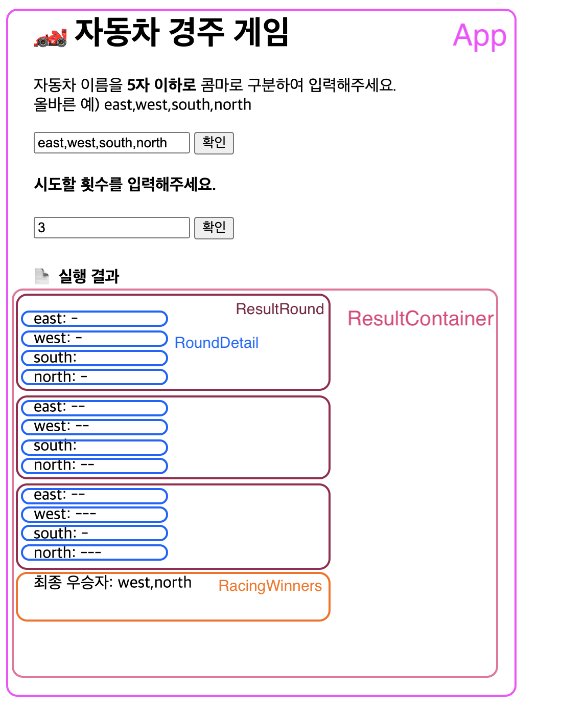

<p align="middle" >
  
</p>
<h1 align="middle">자동차 경주 게임</h1>

---
> ### 자동차들 이름과 시도할 횟수를 입력 받아 게임 결과를 보여줍니다.

- 🕹 게임 진행 방식
- 🎯 구현할 기능 목록
- 📦 폴더 구조
- 📜 컴포넌트 구조

---
## 🕹 게임 진행 방식
- 자동차 이름을 입력 한다
  - 자동차 이름은 쉼표(,)를 기준으로 구분하며 이름은 5자 이하만 가능하다.
- 시도할 횟수를 입력 한다
  - 횟수는 1이상의 정수만 가능하다
  - 자동차 이름을 입력해야만 시도할 횟수를 입력 할수 있다.
- 게임 결과를 구한다
  - 전진하는 조건은 0에서 9 사이에서 무작위 값을 구한 후 무작위 값이 4 이상일 경우이다.
- 게임 결과를 보여준다
  - 각 게임 횟수 마다 결과 값을 보여준다
  - 우승자를 보여준다
  - 자동차이름, 횟수 재 입력 시, 이전 게임결과 화면은 지워진다.
- 사용자가 잘못된 입력 값을 작성한 경우 `alert`을 이용해 메시지를 보여주고, 다시 입력할 수 있게 한다.


---
## 🎯 구현할 기능 목록
- 자동차 이름 입력하기
  - 유효성 판단하기(5자 이하, 쉼표로 구분)
- 시도할 횟수 입력하기
  - 유효성 판단하기(1이상 정수)
- 잘못된 입력 시
  - alert메시지 보여주기
  - 재 입력 하기
- 예외처리
  - 자동차 이름을 입력하지 않고 시도할 회수를 입력하면 에러처리 하기
- 시도할 횟수의 최소 숫자는 1로 지정하기
- 게임 결과 값 구하기
  - 전진하는 조건을 판단하는 랜덤 값 구하기
    - MissionUtils라이브러리의 Random.pickNumberInRange() 사용하기
- 실행 결과 보여주기
  - 각 횟수 마다 게임 결과 보여주기
  - 최종 우승자 보여주기
  - 이전 데이터 결과 노출시 화면 리셋하기


---
## 📦 폴더 구조
```
src
├── components
│   ├── RacingWinners.js
│   ├── ResultContainer.js
│   ├── ResultRound.js
│   └── RoundDetail.js
├── index.js
└── utils
    ├── constants.js
    ├── customError.js
    ├── getCarNames.js
    ├── getGameResult.js
    ├── getUniqueId.js
    └── validation.js
```



## 📜 컴포넌트 구조
### `/index.js(App)`
- **`비즈니스 로직(컨트롤러)`**
- 자동차 이름 입력 받기
  - 유효성 검사 `/utils/validation`
  - `validateCarNames(carNames)`
    ```
      return const validateForm = {
      isError: false,
      errorMessage: ``,
      carNames: [],
      };
    ```
- 자동차 이름(carNames) 객체(`Car`) 선언하기 `/utils/getCarNames`
  ```
  function Car(name) {
  this.name = name;
  this.id = getUniqueId();
  this.moveCount = 0;
  this.moveCounts = [];
  }
  ```
  - getUniqueId() 자동차(Car)를 식별할 수 있는 고유한 값 `/utils/getUniqueId`
- 시도할 횟수 입력 받기
  - 유효성 검사 `/utils/validation`
  - `validateRacingCount({racingCount, isErrorCarNames})`
    ```
      return const validateForm = {
      isError: false,
      errorMessage: ``,
      racingCount,
      };
    ```
- 시도할 횟수 `최소(min) 단위 1`로 설정 하기 `useAttributeInit()`
- 입력값 예외처리(alert) `/utils/customError`
  - `customError({errorMessage, errorCallback})`
- **게임 결과값 구하기 `/utils/getGameResult`**
  -  `getGameResult({carNames,racingCount})`
      ```
        return {
        carNames,
        racingCount,
        maxMoveCount,
        winners,
      };
      ```
- 렌더링 ResultContainer 컴포넌트에 app(DOM), 게임결과값(data) props 전달하기

### `/ResultContainer.js`
- `ResultContainer({app, data})`
- 이전 결과값이 렌더링 되어 있으면 컴포넌트 리셋 시키기
  - `reset()`
- 렌더링
  - `const {carNames, racingCount, winners} = data`
  - 각 시도 횟수(round) 렌더링하기 위해 ResultRound 컴포넌트에 자동차 이름별 게임 결과값(carNames), 시도 횟수(round) props 전달하기
    ```
      for (let round = 0; round < racingCount; round++) {
        ResultRound(carNames, round);
      }
    ```
  - 최종 우승자 렌더링하기 위해 RacingWinners 컴포넌트에 최종 우승자(winners) props 전달하기
    ```
      RacingWinners({winners})
    ```

### `/ResultRound.js`
- `ResultRound(carNames, round)`
- 렌더링
  - 라운드 마다 각 자동차의 결과값 렌더링 하기 위해 RoundDetail 컴포넌트에 자동차 이름(name), 전진 횟수(moveCount) props 전달하기
  ```
    const { name, moveCounts } = car;
    return RoundDetail(name, moveCounts[round]);
  ```

### `/RoundDetail.js`
- `RoundDetail(name, roundMoveCount)`

### `/RacingWinners.js`
- `RacingWinners({winners})`

### `/utils/constants.js`
```
export const PICK_NUMBER_IN_RANGE_MIN = 0;
export const PICK_NUMBER_IN_RANGE_MAX = 9;
export const CAR_NAME_MAX_LENGTH = 5;
```

---
