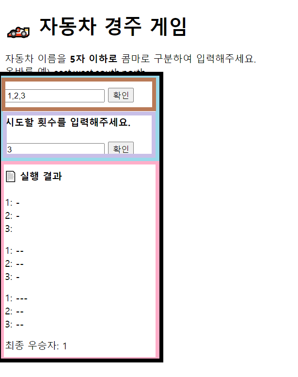

# 🏎️ 자동차 경주 게임

우아한 테크코스 프리코스 2주차 과제

사용자의 입력(자동차 이름, 이동 횟수)을 받는 자동차 경주를 구현한다.

## 데모

[플레이하기](https://jho2301.github.io/javascript-racingcar-precourse/)

## 기능 구현 목록

1. 자동차 이름 입력 받기
   1. 쉼표 기준으로 구분
2. 자동차 이름 입력 검증하기
   1. 예외 시, alert메시지 후 재입력
   2. [예외] 입력이 공백일 때
   3. [예외] 이름이 5자를 넘겼을 때
   4. [예외] 이름이 공백일 때(ex. east,,south)
   5. [예외] 중복되는 이름이 있을 때
3. 올바른 자동차 이름 입력이면, 시도할 횟수 입력창 render하기
4. 시도할 횟수 입력 받기
5. 시도할 횟수 입력 검증하기
   1. 예외 시, alert메시지 후 재입력
   2. [예외] 공백일 때
   3. [예외] 횟수가 0일 때
6. 게임데이터 설정하기
7. 한 번 이동당 각 자동차 이동거리 측정 기능. 0-9사이 랜덤값 추출, 4 이상 전진
8. 실행결과 출력하기
9. 최종 우승자 출력하기
   1. 여러 명일 경우 콤마(,)를 이용하여 구분

## 디렉토리 구조

```
├── LICENSE
├── README.md
├── babel.config.js
├── docs
│   └── README.md
├── images
│   ├── result.gif
│   └── result.jpg
├── index.css
├── index.html
├── jest.config.js
├── package-lock.json
├── package.json
├── src
│   ├── components
│   │   ├── car-game-container.js
│   │   ├── car-names-input.js
│   │   ├── game-play.js
│   │   └── racing-count-input.js
│   ├── index.js
│   └── library
│       ├── classes
│       │   └── car.js
│       ├── constants
│       │   ├── alert-maessage-racing-count.js
│       │   └── alert-message-names.js
│       ├── core
│       │   ├── component.js
│       │   └── state.js
│       └── utils
│           ├── bar.js
│           ├── random-number.js
│           └── validation.js
└── test
    ├── utils.spec.js
    └── validation.spec.js

10 directories, 26 files
```

## 고민한 지점

- 주의 사항에 태그 종류(button 태그, input 태그)가 명시되어있어서 1주차처럼 form태그를 이용해 입력을 받지 않고 기존 HTML 돔 구조를 유지하면서 과제를 진행하였습니다.

- **컴포넌트(모듈화)에 대한 고민 - 컴포넌트는 어디까지 쪼개야하는가**

  설계 처음엔 자동차이름 입력과 이동횟수 입력을 이를 감싸는 container 태그에서 모두 처리하기로 하였습니다. 그렇게 코딩을 하는데 해당 컴포넌트가 하는 일이 여러 개가 되는 것을 느꼈습니다. 이때 컴포넌트의 최소 단위에 대한 기준을 다시 고민하기 시작했습니다. 제가 찾은 답은 [react의 공식 문서](https://reactjs-kr.firebaseapp.com/docs/thinking-in-react.html)에서 확인할 수 있었는데, 함수나 객체를 만들 지 말 지 결정하는 기준을 그대로 적용하라는 것이었습니다. 단일 책임 원칙에 따라 컴포넌트 역시 하나의 작업만 하는 것이 이상적이라는 것이었습니다.
  그래서 저는 해당 컴포넌트를 두 개의 서브 컴포넌트로 분리하였고 각자가 하는 일을 하나씩 맡게끔 할 수 있었습니다.

- **더 나은 코드를 위한 독서**

  **리팩토링**과 **클린코드**를 읽고 있습니다. 어떻게 좀 더 가독성이 좋은 코드를 짤 것인지에 대한 고민을 쭉 하고 있습니다. 두 책이 상충되는 내용(불용어를 사용하지마라 vs 관사를 이용한다)이 가씀씩 있습니다만 전반적으로 하고자 하는 이야기는 같다고 느꼈습니다. 전문 개발자는 시스템을 프로그램이 아닌 하나의 이야기로 받아들인다는 부분을 깊게 생각해봤으며, 코드가 하나의 신문기사로 읽힐 수 있도록 하는 여러 디테일한 부분을 배울 수 있었습니다. 계속해서 읽어 내재화하는데 노력을 쏟겠습니다.

- **예외처리에 대한 고민**

  어떤 예외를 어떻게 처리할 것인가 고민하였습니다. 요구사항에 기재가 되지 않은 내용이었으나 사용자가 통상적으로 느끼는 pain point를 고려해봤습니다. 그래서 빈 입력, 자동차이름이 비었을 때, 중복된 이름을 입력했을 때를 예외로 정해 alert메시지에 각각의 에러가 나타나도록 하였습니다.

- 다른 분의 1주차 과제 PR에서 아이디어를 얻어 HTML의 모든 컨텐츠가 로딩되었을 때 클래스 내부에서 단일 메서드만 로딩하는 것이아니라 클래스 자체를 생성하기로하였습니다 보다 높은 가독성을 얻을 수 있었습니다.

## 컴포넌트 구성



각 갈색과 보라 컴포넌트는 사용자 입력을 받고 검증합니다. (갈색컴포넌트의 입력, 검증이 완료됐다면 보라컴포넌트가 UI상에 나타납니다)

두 컴포넌트의 입력이 유효하다면, 파랑 컴포넌트에서 해당 입력들을 객체로 만들어 검정 최상위 컴포넌트에 전달합니다.

검정 최상위 컴포넌트는 분홍컴포넌트로 해당 객체를 넘겨줍니다.

분홍 컴포넌트는 전달받은 객체를 바탕으로 게임을 진행하고 진행 결과, 최종우승자를 UI에 나타냅니다.

## 주의사항

- **함수(또는 메소드)의 길이가 15라인을 넘어가지 않도록 구현한다.**
  - 함수(또는 메소드)가 한 가지 일만 잘 하도록 구현한다.
- 자동차의 이름을 입력하는 input 태그는 `#car-names-input` id값을 가진다.
- 자동차의 이름을 제출하는 button 태그는 `#car-names-submit` id값을 가진다.
- 레이싱 횟수를 입력하는 input 태그는 `#racing-count-input` id값을 가진다.
- 레이싱 횟수을 제출하는 button 태그는 `#racing-count-submit` id값을 가진다.
- indent(인덴트, 들여쓰기) depth를 3이 넘지 않도록 구현한다. 2까지만 허용한다.
